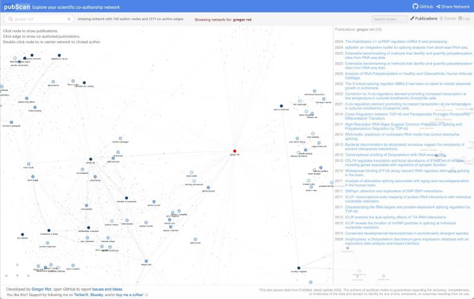

<picture></picture>
# Welcome to pubScan v3!

A public instance of this platform is available at [https://pubscan.org](https://pubscan.org)

## What is it?
pubScan is an interactive interface to explore all PubMed articles as a co-authorship network. In this network
<b>nodes represent authors</b> and <b>edges represent co-authored publications</b>.

<picture></picture>

## Who appears at the center of the network?
The author you search for in the input box (top-left) will appear at the center of the network, highlighted in red.
Other nodes are colored based on the number of publications for the author in PubMed:
 < 10 publications,  10-50 publications,  50-100 publications,  > 100 publications

## Are all co-authors shown?
To keep the network readable and responsive, pubScan displays:

* up to 150 co-authors (ranked by number of shared publications)
* up to 2,000 edges: this includes all edges between the central author and their co-authors, the 100 strongest co-authorship links, and a random sample of the remaining edges

## Changelog

* 202610: v3.1, much faster network retrieval: co-author degree to the centre is computed first and the pairwise co-authorship step runs only on the 100 kept nodes (prolific authors: 10-13 s to under 1 s); database files are read into the page cache at container start to avoid slow cold-disk lookups; unused column dropped from the publications table (database 13.7 GB to 9.4 GB); fixed lookups for ORCIDs whose check digit is X
* 202605: v3, switched from parsing PubMed records to OpenAlex formatted data, with only considering authors ORCID records to result in author name disambiguation
* 202510: v2, Faster and simpler SQLite backend, mobile friendly
* 202412: v1, Initial interface with a Mysql database

## Love it? Want to support the project?
Star it and spread the word :-) Thanks
