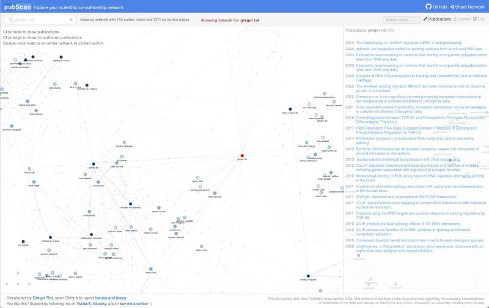

<picture></picture>
# Welcome to pubScan!

## What is it?
pubScan is an interactive interface to explore all PubMed articles as a co-authorship network. In this network
<b>nodes represent authors</b> and <b>edges represent co-authored publications</b>.

<picture></picture>

## Who appears at the center of the network?
The author you search for in the input box (top-left) will appear at the center of the network, highlighted in red.
Other nodes are colored based on the number of publications for the author in PubMed:
 < 10 publications,  10-50 publications,  50-100 publications,  > 100 publications

## Are all co-authors shown?
To keep the network readable and responsive, pubScan displays:
Up to 150 co-authors (ranked by number of shared publications)
Up to 2,000 edges: this includes all edges between the central author and their co-authors, the 100 strongest co-authorship links, and a random sample of the remaining edges

## Love it? Want to support the project?
Star it and spread the word :-) Thanks
